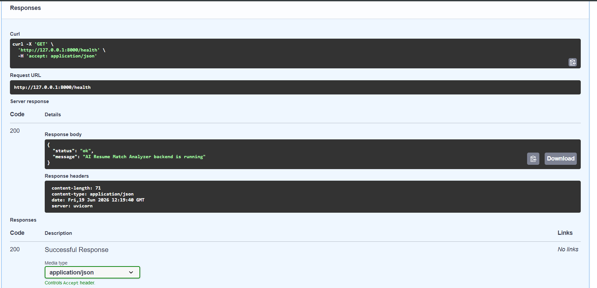
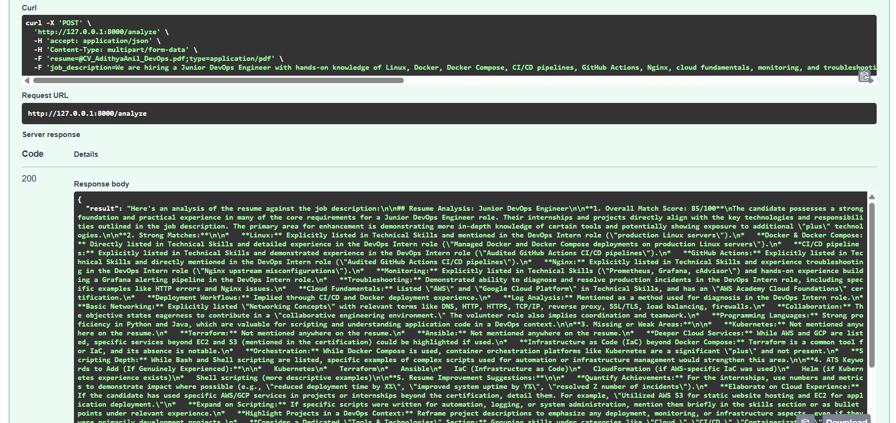
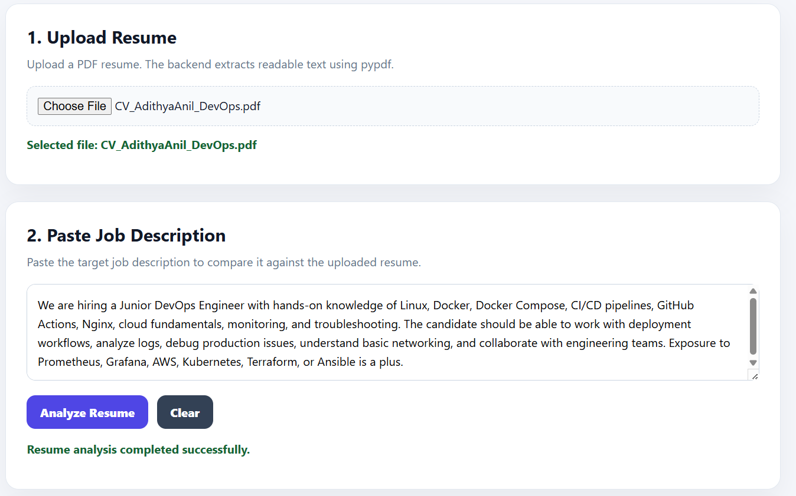
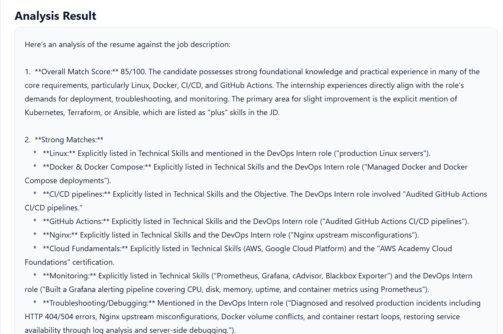
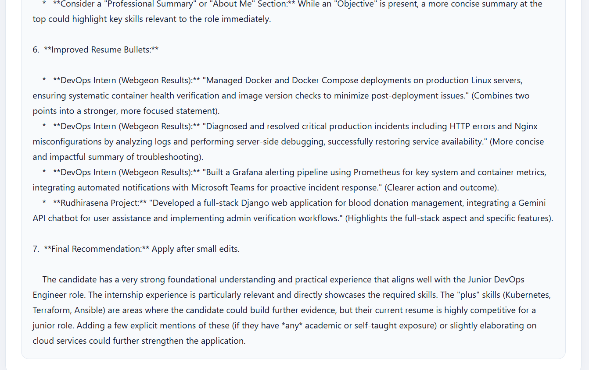

# 📄 AI Resume Match Analyzer — Resume-to-Job Description Matching Assistant

<div align="center">


**A full-stack AI career assistant that compares a resume PDF against a target job description and generates a structured match score, strong matches, missing skills, ATS keywords, resume improvement suggestions, and improved resume bullets.**

[🚀 Quick Start](#-quick-start) · [🧠 Architecture](#-system-architecture) · [🌐 Frontend](#-web-application) · [🔌 API](#-api-endpoints) · [📸 Screenshots](#-screenshots)

</div>

---

## 📌 Overview

AI Resume Match Analyzer is a full-stack AI application built to help candidates evaluate how well their resume matches a specific job description.

The application allows users to upload a PDF resume, paste a target job description, and receive a structured AI-generated analysis. The system extracts readable text from the resume, combines it with the job description, sends it through a carefully designed Gemini prompt, and returns recruiter-friendly feedback.

The project focuses on practical career workflows such as resume screening, ATS keyword matching, skill gap identification, and role-specific resume improvement — while avoiding exaggerated or fabricated experience.

> **Key Idea:** The AI should improve how the resume is presented, not invent experience that the candidate does not actually have.

---

## 🎯 Why I Built This

I built this project to understand how AI can assist with real-world career workflows such as resume screening, job matching, and resume optimization.

The main goal was to explore:

* Resume PDF parsing
* Job description analysis
* Prompt engineering for structured career feedback
* ATS keyword extraction
* Skill gap identification
* Guardrails against exaggerated resume claims
* Frontend-backend integration using FastAPI and React

This project helped me understand how AI applications can be designed for practical decision support rather than generic chatbot-style responses.

---

## ✨ Features

* 📄 Upload resume PDF
* 🧾 Extract readable resume text using `pypdf`
* 📝 Paste a target job description
* 🤖 Analyze resume-to-job description fit using Gemini
* 📊 Generate an overall match score
* ✅ Identify strong matches between resume and JD
* ⚠️ Detect missing or weak areas
* 🔍 Suggest ATS keywords only if genuinely applicable
* 🛠️ Provide resume improvement suggestions
* ✍️ Rewrite improved resume bullets without exaggerating experience
* 🧭 Provide final recommendation: apply now, apply after edits, or build more evidence
* 🌐 React frontend for resume upload, JD input, and result display
* 🔗 CORS-enabled frontend-backend integration

---

## 🧠 System Architecture

```text
Resume PDF Upload
   │
   ▼
Resume Text Extraction using pypdf
   │
   ▼
Job Description Input
   │
   ▼
Prompt Construction with Guardrails
   │
   ▼
Gemini Resume-JD Analysis
   │
   ▼
Structured Output:
Match Score + Strong Matches + Missing Skills
ATS Keywords + Improved Bullets + Final Recommendation
   │
   ▼
Frontend Result Display
```

### Core Analysis Flow

| Stage            | Component            | Purpose                                       |
| ---------------- | -------------------- | --------------------------------------------- |
| Resume Upload    | React + FastAPI      | Accept PDF resume from user                   |
| Text Extraction  | pypdf                | Extract readable text from the resume         |
| JD Input         | React textarea       | Accept target job description                 |
| Prompt Design    | Custom Gemini prompt | Structure the analysis with strict guardrails |
| AI Analysis      | Gemini API           | Generate resume-JD match feedback             |
| API Response     | FastAPI              | Return structured analysis result             |
| Frontend Display | React                | Show the complete analysis clearly            |

---

## 🌐 Web Application

The React frontend provides a simple interface for testing the complete workflow.

### Frontend Capabilities

* Upload a PDF resume
* Paste a job description
* Submit resume and JD for analysis
* View match score and reasoning
* View strong matches and missing skills
* View ATS keyword suggestions
* View improved resume bullets
* Clear inputs and test another job description

---

## 🔌 API Endpoints

| Method | Endpoint   | Purpose                                    |
| ------ | ---------- | ------------------------------------------ |
| GET    | `/health`  | Check backend health                       |
| POST   | `/analyze` | Analyze resume PDF against job description |

---

## 🛠️ Tech Stack

| Layer                  | Technology          |
| ---------------------- | ------------------- |
| Backend                | FastAPI, Uvicorn    |
| Frontend               | React, Vite         |
| LLM                    | Gemini API          |
| PDF Processing         | pypdf               |
| Environment Management | python-dotenv       |
| Data Format            | Multipart form data |
| Language               | Python, JavaScript  |

---

## 📁 Project Structure

```text
AI-Resume-Match-Analyzer/
│
├── backend/
│   ├── app/
│   │   ├── main.py              # FastAPI routes, upload handling, CORS
│   │   ├── config.py            # Environment and app configuration
│   │   ├── pdf_loader.py        # Resume PDF text extraction
│   │   ├── resume_analyzer.py   # Gemini prompt and analysis logic
│   │   └── schemas.py           # Pydantic response schemas
│   │
│   ├── uploads/                 # Local uploaded resumes ignored by Git
│   ├── requirements.txt
│   ├── .env.example
│   └── .gitignore
│
├── frontend/
│   ├── src/
│   │   ├── App.jsx              # React application logic
│   │   ├── App.css              # Main UI styling
│   │   ├── index.css
│   │   └── main.jsx
│   │
│   ├── package.json
│   └── vite.config.js
│
├── screenshots/
│   ├── backend-health-check.png
│   ├── backend-analyze-success.png
│   ├── frontend-form-filled.png
│   ├── frontend-analysis-score.png
│   └── frontend-improved-bullets.png
│
├── README.md
└── .gitignore
```

---

## 🚀 Quick Start

### Prerequisites

* Python 3.10+
* Node.js and npm
* Gemini API key
* Git

---

### 1. Clone the Repository

```bash
git clone https://github.com/aadi090204/AI-Resume-Match-Analyzer.git
cd AI-Resume-Match-Analyzer
```

---

### 2. Backend Setup

Go to the backend folder:

```bash
cd backend
```

Create and activate a virtual environment:

```bash
python -m venv venv
venv\Scripts\activate
```

Install backend dependencies:

```bash
pip install -r requirements.txt
```

Create a `.env` file inside the `backend` folder:

```env
GEMINI_API_KEY=your_gemini_api_key_here
```

Start the FastAPI backend:

```bash
uvicorn app.main:app --reload
```

Open the backend API docs:

```text
http://127.0.0.1:8000/docs
```

---

### 3. Frontend Setup

Open a new terminal and go to the frontend folder:

```bash
cd AI-Resume-Match-Analyzer/frontend
```

Install frontend dependencies:

```bash
npm install
```

Start the React development server:

```bash
npm run dev
```

Open the frontend:

```text
http://localhost:5173
```

---

## 🧪 Sample Job Description Used for Testing

```text
We are hiring a Junior DevOps Engineer with hands-on knowledge of Linux, Docker, Docker Compose, CI/CD pipelines, GitHub Actions, Nginx, cloud fundamentals, monitoring, and troubleshooting. The candidate should be able to work with deployment workflows, analyze logs, debug production issues, understand basic networking, and collaborate with engineering teams. Exposure to Prometheus, Grafana, AWS, Kubernetes, Terraform, or Ansible is a plus.
```

---

## 📸 Screenshots

### Backend Health Check



### Backend Analyze API



### Frontend Resume Analysis Form



### Match Score and Skill Gap Analysis



### Resume Improvement Suggestions



---

## ⚠️ What Went Wrong

While building the project, I had to handle a few practical issues:

1. The resume analysis output initially suggested fake placeholders like `X%` and `Y minutes`.
2. The AI prompt needed stricter rules to avoid exaggerated resume claims.
3. The browser frontend required CORS configuration to communicate with the FastAPI backend.
4. Resume PDF extraction depends on whether the uploaded PDF contains readable text.
5. Very short job descriptions produced less useful analysis, so realistic JD input was needed for better results.

---

## ✅ How I Fixed It

* Added prompt rules to prevent fake metrics and exaggerated experience.
* Updated improved bullet instructions to avoid numbers unless clearly present in the resume.
* Added CORS middleware in FastAPI for local frontend-backend integration.
* Added validation for PDF uploads and empty job descriptions.
* Used structured output sections to make the analysis recruiter-friendly.
* Tested the app with a realistic Junior DevOps Engineer job description.

---

## 📚 What I Learned

* AI resume analysis needs strict guardrails to avoid inventing experience.
* Prompt design directly affects output quality and trustworthiness.
* PDF parsing is simple for text-based resumes but may fail for scanned resumes.
* Full-stack AI apps need clean API contracts between frontend and backend.
* Career-focused AI tools can be built with practical workflows instead of generic chatbot interfaces.
* AI-generated resume feedback is more useful when the output is structured around recruiter decision points.

---

## 🗺️ Future Work

* [ ] Add support for DOCX resumes
* [ ] Add downloadable analysis report
* [ ] Add structured JSON output from Gemini
* [ ] Add resume section-wise scoring
* [ ] Add multiple job description comparison
* [ ] Add authentication and user analysis history
* [ ] Deploy frontend and backend
* [ ] Add Dockerfile and Docker Compose after local Docker testing
* [ ] Add role-specific analysis modes such as DevOps, Software Engineer, Data Analyst, and AI Engineer

---

## 🔐 Security Notes

* The `.env` file is ignored by Git and should never be committed.
* Uploaded resumes are stored locally only during development.
* The app should not be used with sensitive personal resumes in production unless authentication, encryption, and secure storage are added.
* AI suggestions should be reviewed manually before updating a real resume.

---

## 📄 Disclaimer

This project is for educational and portfolio purposes only. The analysis should be treated as AI-assisted feedback, not as a guaranteed hiring outcome. The system does not guarantee ATS selection, interview calls, or job offers.

---

## 👤 Author

**Adithya Anil**
AI Engineer / DevOps Engineer
GitHub: [aadi090204](https://github.com/aadi090204)

---

<div align="center">
<i>Built as a full-stack AI project exploring resume parsing, prompt engineering, ATS-style keyword analysis, and career-focused AI assistance.</i>
</div>
